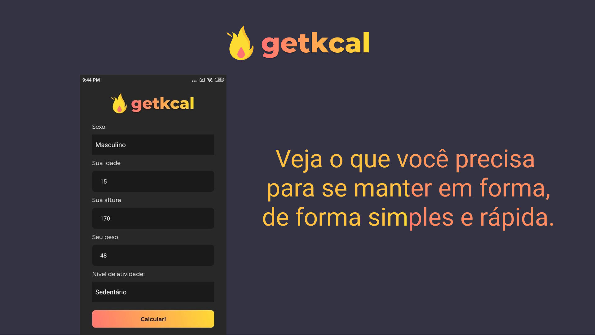

# Getkcal Mobile

Com esse aplicativo você pode ver quantas calorias, você precisa,
para emagrecer, quantas você precisa para engordar, e quantas você precisa, 
para se manter em forma; pode ver também a sua tmb.

Clonar o projeto

### `git clone https://github.com/gottium-kaique/getkcal-mobile.git`

Acessar a pasta do projeto

### `cd getkcal-mobile`

Instalar todas as dependências

### `npm i`

Rode a aplicação em modo de desenvolvedor

### `npm start`

## Autor

👤**Kaique Araújo**

<h4 align="left">Feito com ♥ e TypeScript.</h4>